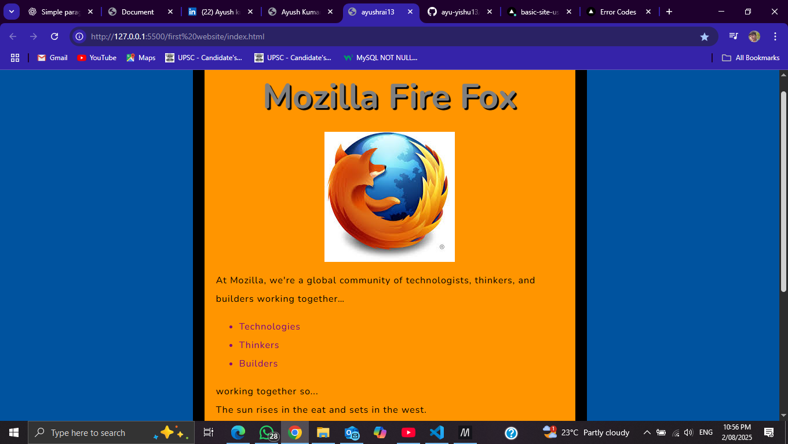

🌐 Basic Website using HTML and CSS

This is a simple static website created using **HTML5** and **CSS3**, designed as a practice project. The site focuses on layout design, typography, color usage, and basic content structure using semantic HTML.

---

## 🚀 Features

- Fully responsive layout
- Clean and colorful design
- Mozilla Firefox-themed example
- Lists, images, headings, and text formatting
- Beginner-friendly code structure

---

## 🛠️ Tech Stack

| Technology | Purpose              |
|------------|----------------------|
| HTML5      | Structure & Markup   |
| CSS3       | Styling & Layout     |

---

## 📁 Folder Structure

Basic-Site-using-HTML-and-CSS/
│
├── index.html # Main webpage
├── style.css # Styling file
└── README.md # Project documentation

yaml
Copy
Edit

---

## 📸 Screenshot

> This is how the website looks in the browser:



---

## 💻 How to Run

1. Clone this repository:
   ```bash
   git clone https://github.com/ayu-yishu13/Basic-Site-using-HTML-and-CSS.git
Navigate to the folder and open index.html in your browser.

🙋‍♂️ Author
Ayush Kumar Rai
GitHub • LinkedIn
